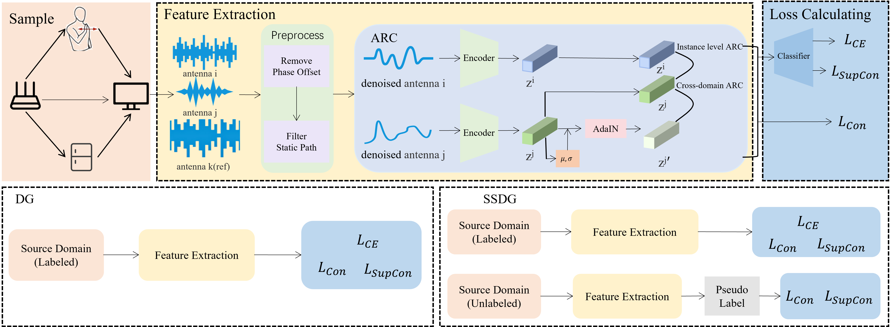

<h1 align="center">UniCrossFi: A Unified Framework For Cross-Domain Wi-Fi-based Gesture Recognition</h1>

<div align="center">
  <a href="https://arxiv.org/abs/2310.06328" target="_blank">
    
  </a>
 <a href="https://opensource.org/licenses/MIT" target="_blank">
  
</a>
</div>
<div align="center">
    <a href=https://sz.ustc.edu.cn/rcdw_show/274.html>
        Ke Xu
    </a>
    ,
        Zhiyong Zheng
    ,
    <a href=https://hongyuanzhu.github.io>
				Hongyuan Zhu
    </a>
    ,
    <a href=https://web.suda.edu.cn/wanglei/>
        Lei Wang
    </a>
    ,
    <a href=https://saids.ustc.edu.cn/2024/0722/c36359a648226/page.htm>
        Jiangtao Wang
    </a>
</div>
This is the official open-source implementation of [**UniCrossFi: A Unified Framework for Cross-Domain Wi-Fi-based Gesture Recognition**](https://arxiv.org/abs/2310.06328).

##  **📘Abstract**

Wi-Fi sensing systems are severely hindered by cross domain problem when deployed in unseen real-world environments. 
Existing methods typically design separate frameworks for either domain adaptation or domain generalization, often relying on extensive labeled data. Existing methods that designed for domain generalization is often relying on extensive labeled data.
However, real-world scenarios are far more complex, where the deployed model must be capable of handling generalization under limited labeled source data.To this end, we propose UniCrossFi, a unified framework designed to mitigate performance drop in CSI-based sensing across diverse deployment settings. Our framework not only extends conventional Domain Generalization (DG) to a more practical Semi-Supervised Domain Generalization (SSDG) setting, where only partially labeled source data are available, but also introduces a physics-informed data augmentation strategy, Antenna Response Consistency (ARC). ARC mitigates the risk of learning superficial shortcuts by exploiting the intrinsic spatial diversity of multi-antenna systems, treating signals from different antennas as naturally augmented views of the same event. In addition, we design a Unified Contrastive Objective to prevent conventional contrastive learning from pushing apart samples from different domains that share the same class.We conduct extensive experiments on the public Widar and CSIDA datasets. The results demonstrate that UniCrossFi consistently establishes a new state-of-the-art, significantly outperforming existing methods across all unsupervised domain adaptation, DG, and SSDG benchmarks. UniCrossFi provides a principled and practical solution to the domain shift challenge, advancing the feasibility of robust, real-world Wi-Fi sensing systems that can operate effectively with limited labeled data.



## **🏃‍♂️ Running the Code:**

You can run our method by executing a command in the following form(You may need to modify the file paths accordingly.):

```shell
bash bash/UniCrossFi/UniCrossFi_semidg_widar.sh
```

If you are interested in our data processing method on widar, please refer to: `/data/TD_CSI_process_widar.py`

You can use the `optuna_UniCrossFi_launch.py` script to perform hyperparameter optimization.

## 📂 Dataset

+ [CSIDA](https://pan.baidu.com/s/1p-DYPv2xDBEJIWqLMb3Tfg?pwd=byvj)
+ [Widar3.0](https://tns.thss.tsinghua.edu.cn/widar3.0/)

## **🙋 Support**

If you encounter any issues or need assistance, feel free contact us zhiyongzheng@mail.ustc.edu.cn.

